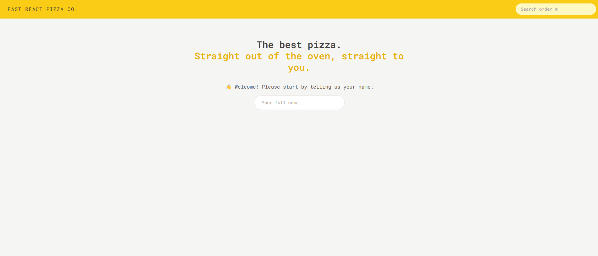
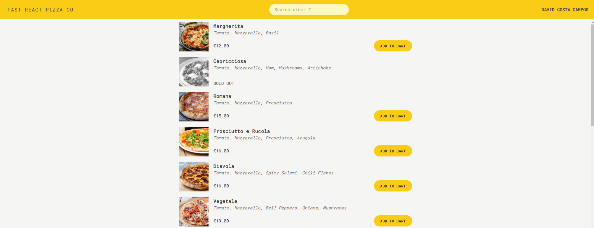
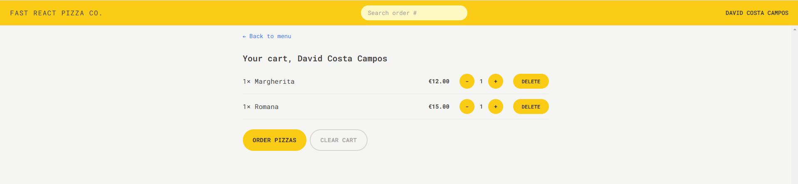
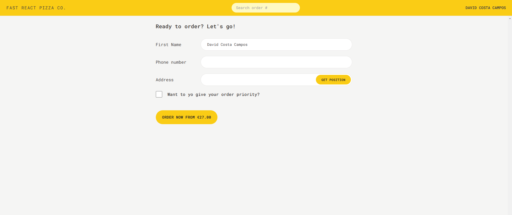
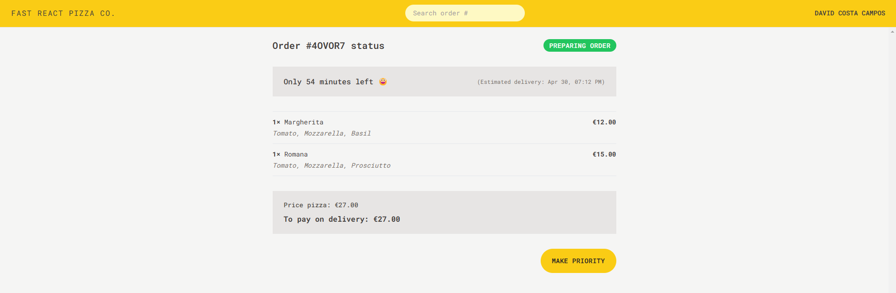

# Fast-React-Pizza

## Overview

A modern React app that allows users to **order pizza** from a menu by entering their **name, phone number, and address**.  
The app calculates **total price**, estimates **delivery time**, and uses geolocation to enhance the user experience.

Built with **Vite**, **Redux**, **TailwindCSS**, and the [BigDataCloud API](https://api.bigdatacloud.net).

## Live Demo

This web app was deployed on vercel, it can be tried in here -> [Fast-React-Pizza](https://fast-react-pizza-phi-eight.vercel.app/)

## Preview







## Features

- Browse and order from a pizza list
- Enter customer info (name, phone, address)
- See real-time total price calculation
- Get estimated delivery time
- Uses [BigDataCloud API](https://api.bigdatacloud.net) for address/geolocation
- Global state management with Redux Toolkit
- Mobile-responsive with TailwindCSS

## Technologies

- React (via [Vite](https://vitejs.dev/))
- Redux Toolkit
- Tailwind CSS
- BigDataCloud API
- JavaScript

## Getting Started

To run this project locally:

1. Clone the repo:

   ```bash
   git clone https://github.com/davidccgithub/fast-react-pizza.git
   cd fast-react-pizza
   ```

2. Install dependencies:

   ```bash
   npm install
   ```

3. Start the server:
   ```bash
   npm run dev
   ```

The app will run on [http://localhost:5173/](http://localhost:5173/).

## Disclaimer

This project was built for educational purposes only.
